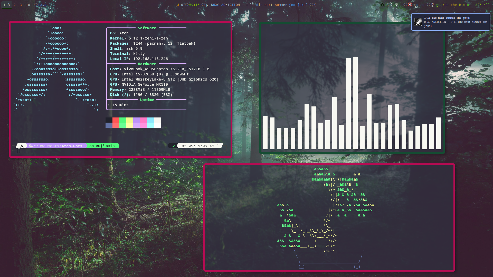

# Arch-Dots
My arch linux i3-gaps dotfiles

**Distro**: Arch Linux

**WM**: i3-gaps

**Compositor**: Picom

**Terminal**: Kitty

**Bar**: Polybar

**App Launcher**: [Rofi](https://github.com/adi1090x/rofi)

**Lock Manager**: i3lock-color

**Login Manager**: GDM

**Notify Deamon**: Dunst

**Discord**: BetterDiscord [GitHub Dark](https://betterdiscord.app/theme/GitHub%20Dark)
